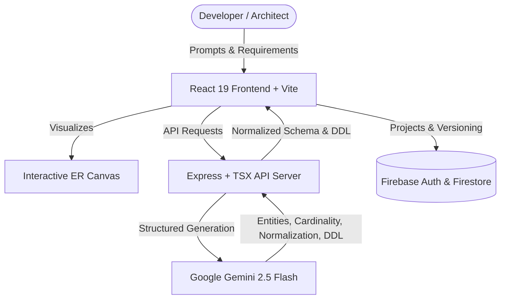

<div align="center">


# 🧠 Agentic AI Database Schema Designer

**An intelligent, agentic database architect and schema engineering platform powered by Google Gemini.**

[](https://react.dev/)
[](https://www.typescriptlang.org/)
[](https://vitejs.dev/)
[](https://tailwindcss.com/)
[](https://ai.google.dev/)
[](https://firebase.google.com/)
[](LICENSE)

[Features](#-key-features) • [Architecture](#-architecture--tech-stack) • [Getting Started](#-getting-started) • [Environment Setup](#-environment-configuration) • [Workflow](#-workflow) • [Project Structure](#-project-structure)

</div>

---

## 🌟 Overview

The **Agentic AI Database Schema Designer** bridges the gap between high-level product requirements and mathematically sound, production-ready relational database architectures. 

By leveraging the **Google Gemini API** with strict structured schema constraints, this tool autonomously designs, normalizes (up to **3NF**), visualizes, and evolves database schemas across multiple SQL dialects (**PostgreSQL**, **MySQL**, **SQLite**, and **Oracle**).

---

## ✨ Key Features

- **🤖 Natural Language Schema Synthesis**: Describe requirements in plain English (e.g., *"Design an e-commerce platform with multi-vendor inventory, order fulfillment, and role-based access"*), and let the agent construct a comprehensive relational schema.
- **📐 Mathematical Normalization Engine (1NF &rarr; 2NF &rarr; 3NF)**:
  - **1NF**: Elimination of repeating groups, ensuring atomic column values.
  - **2NF**: Elimination of partial dependencies on composite primary keys.
  - **3NF**: Elimination of transitive dependencies.
  - Generates clear, pedagogical reasoning logs explaining why each decomposition occurred.
- **🔄 Schema Evolution & Migration DDL**: When requirements change, the agent compares the previous schema version against incoming specifications and produces safe, non-destructive `ALTER TABLE` migration scripts alongside the updated `CREATE TABLE` scripts.
- **🗺️ Interactive ER Diagram Visualizer**: Interactive canvas displaying entities, columns, primary keys, foreign keys, nullable constraints, and relationship cardinalities (`1:1`, `1:N`, `N:M`).
- **🌐 Multi-Dialect SQL Generation**: Generates clean, idiomatic SQL tailored for:
  - **PostgreSQL** (UUIDs, `TIMESTAMPTZ`, serials, foreign keys)
  - **MySQL** (`AUTO_INCREMENT`, engine specs, `DATETIME`)
  - **SQLite** (`INTEGER PRIMARY KEY`, lightweight data types)
  - **Oracle** (`NUMBER`, `VARCHAR2`, sequence patterns)
- **📜 Schema Versioning & Audit Trail**: Save, compare, and roll back across historical schema versions for any project.
- **🔐 Cloud Persistence & Authentication**: Integrated with Firebase Authentication and Cloud Firestore for multi-tenant workspace isolation.

---

## 🏗️ Architecture & Tech Stack



| Layer | Technologies |
| :--- | :--- |
| **Frontend UI** | React 19, TypeScript, Tailwind CSS v4, Lucide Icons, Framer Motion |
| **Server & Bundler** | Node.js, Express, Vite 6, TSX, ESBuild |
| **AI / LLM Engine** | Google GenAI SDK (`@google/genai`), Structured JSON Schema Output |
| **Database & Auth** | Firebase Authentication, Cloud Firestore |

---

## 📁 Project Structure

```text
agentic-database-schema-designer/
├── assets/                    # Static assets & brand media
├── src/
│   ├── components/
│   │   ├── AuthScreen.tsx     # Firebase Authentication modal & forms
│   │   ├── Dashboard.tsx      # Project management & workspace overview
│   │   ├── ErDiagram.tsx      # Interactive entity-relationship diagram renderer
│   │   ├── NewProjectModal.tsx# Dialect & normalization setup dialog
│   │   └── Workspace.tsx      # Main schema studio, chat interface & DDL inspector
│   ├── lib/
│   │   └── firebase.ts        # Firebase app, auth, and Firestore initialization
│   ├── App.tsx                # App root & authentication state machine
│   ├── index.css              # Global styles & Tailwind configuration
│   ├── main.tsx               # Client entry point
│   └── types.ts               # Core domain models (Schema, Entity, Column, Version)
├── firebase.json              # Firebase hosting and emulators configuration
├── firestore.rules            # Firestore security rules
├── metadata.json              # Applet metadata
├── server.ts                  # Express backend & Gemini integration
├── tsconfig.json              # TypeScript compiler configuration
└── vite.config.ts             # Vite development & build setup
```

---

## 🚀 Getting Started

### Prerequisites

- **Node.js** (v18.0.0 or later recommended)
- **npm** or **yarn** / **pnpm**
- A **Google Gemini API Key** ([Get one from Google AI Studio](https://aistudio.google.com/app/apikey))

### 1. Clone the Repository

```bash
git clone https://github.com/jeevags112/agentic-ai-db.git
cd agentic-ai-db
```

### 2. Install Dependencies

```bash
npm install
```

### 3. Configure Environment Variables

Create a `.env` file in the root directory by copying the example template:

```bash
cp .env.example .env
```

Set your Gemini API key in `.env`:

```env
# Google Gemini API Key
GEMINI_API_KEY="your-gemini-api-key-here"

# Application URL (default for local development)
APP_URL="http://localhost:3000"
```

### 4. Run the Development Server

```bash
npm run dev
```

Open your browser and navigate to:
```text
http://localhost:3000
```

---

## ⚙️ Environment Configuration

| Variable | Description | Default | Required |
| :--- | :--- | :--- | :---: |
| `GEMINI_API_KEY` | Your Google Gemini API authentication key | `""` | **Yes** |
| `APP_URL` | Base host URL for the application | `http://localhost:3000` | No |

> [!NOTE]
> Firebase credentials are loaded dynamically from `firebase-applet-config.json` via `/api/firebase-config` for multi-environment deployments.

---

## 🔄 Workflow

```text
1. Project Creation ──> Select target SQL dialect (Postgres, MySQL, SQLite, Oracle)
                          and target normalization level (1NF, 2NF, 3NF).
                          
2. Agent Prompting   ──> Submit system requirements via natural language prompt.
                          
3. AI Generation     ──> Gemini analyzes functional dependencies, produces entities,
                          computes relationships, and outputs clean DDL.
                          
4. ER Inspection     ──> Explore the visual ER diagram canvas with keys and constraints.
                          
5. Schema Evolution  ──> Provide updated requirements; the agent produces an updated schema
                          and automatically writes ALTER TABLE migration scripts.
                          
6. DDL Export        ──> Copy or export production-ready SQL scripts directly to your database.
```

---

## 🛡️ Security

- **Secrets Sanitization**: `.env` and `.env.local` are excluded via `.gitignore` to prevent sensitive credentials from leaking into source control.
- **Client-Side Auth**: Firestore security rules (`firestore.rules`) enforce user-level document isolation so users can only access their own projects.

---

## 📄 License

This project is open-source and licensed under the [MIT License](LICENSE).

---

<div align="center">
  <sub>Built with ❤️ using Google Gemini & React</sub>
</div>
